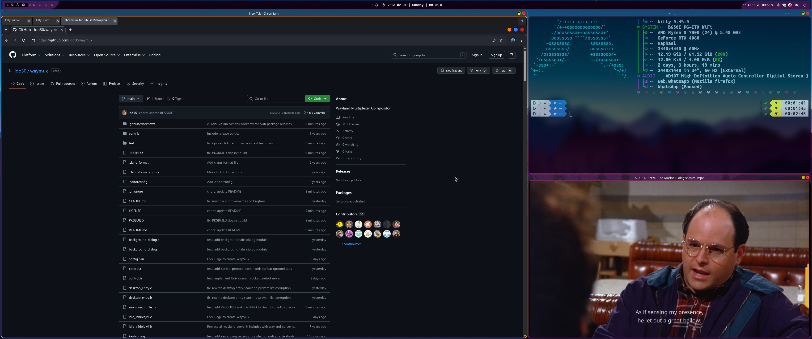

# WayMux: a Wayland Multiplexer Compositor

WayMux is a tabbed Wayland compositor that allows you to run multiple applications
in tabs within a single window hosted by a parent compositor (e.g. Hyprland).
It's a fork of [Cage](https://github.com/cage-kiosk/cage) enhanced with tab
management, application launching, and profile support.

## Table of Contents

<!-- vim-markdown-toc GFM -->

* [Features](#features)
* [Installation](#installation)
	* [Arch Linux (AUR)](#arch-linux-aur)
	* [From Source](#from-source)
* [Usage](#usage)
	* [Basic Usage](#basic-usage)
	* [Keyboard Shortcuts](#keyboard-shortcuts)
	* [Background Tabs](#background-tabs)
	* [Control Client](#control-client)
	* [Profiles](#profiles)
		* [Profile Selector](#profile-selector)
		* [Profile-Specific Desktop Entries](#profile-specific-desktop-entries)
	* [Multiple Instances](#multiple-instances)
* [Documentation](#documentation)
* [Rationale](#rationale)
	* [Development Methodology](#development-methodology)
* [Bugs](#bugs)
* [Author](#author)
* [License](#license)

<!-- vim-markdown-toc -->

## Features

- **Tabbed interface**: Run multiple applications in a single window with easy tab switching
- **Background tabs**: Hide tabs from the tab bar while keeping them running
- **Application launcher**: Quick access to all installed applications via XDG desktop entries
- **Profiles**: Preconfigure sessions with multiple applications, environment variables, and settings
- **Multiple instances**: Run several WayMux instances simultaneously, each with a unique name
- **Keyboard-driven**: Full keyboard control for tab management and application launching
- **Wayland native**: Built on wlroots for a pure Wayland experience
- **Client-server protocol**: Control a WayMux instance from outside with `waymuxctl`



In this screenshot, WayMux is the large window in the master area (left) of the
screen. Notice the tab bar showing multiple applications. Everything outside
of this window is the host compositor (Hyprland in this case).

## Installation

### Arch Linux (AUR)

WayMux is available as `waymux-bin` in the AUR:

```bash
paru -S waymux-bin
# or
yay -S waymux-bin
```

You can also download prebuilt packages from the [Releases](https://github.com/ido50/waymux/releases) page.

### From Source

WayMux uses the [Meson](https://mesonbuild.com/) build system and requires:

- wlroots 0.19
- wayland-protocols
- libxkbcommon
- cairo
- tomlc17
- scdoc (for man pages, optional)
- check (for tests, optional)

```bash
meson setup build
meson compile -C build
sudo meson install -C build
```

For a release build:

```bash
meson setup build --buildtype=release
```

## Usage

### Basic Usage

Start WayMux with an application:

```bash
waymux kitty
```

Start with multiple applications:

```bash
waymux foot -- emacs
```

You can start an empty WayMux window by simply running `waymux`. An application
launcher will show.

### Keyboard Shortcuts

All keyboard shortcuts are configurable. By default, WayMux uses the Super
(Windows/Logo) key as the modifier key:

| Shortcut        | Action                                    |
|-----------------|-------------------------------------------|
| `Super+J`       | Switch to previous tab                    |
| `Super+K`       | Switch to next tab                        |
| `Super+D`       | Close current tab                         |
| `Super+B`       | Send current tab to the background        |
| `Super+Shift+B` | Show/hide background tabs dialog          |
| `Super+N`       | Show application launcher to open new tab |

In dialogs and launchers:

- Type to filter
- Arrow keys to navigate
- Enter to select
- Escape to cancel

To change the shortcuts, create a configuration file for WayMux. WayMux searches
for the configuration file in the following order:

1. Path specified with the `-c` command-line option
2. `$XDG_CONFIG_HOME/waymux/config.toml`
3. `~/.config/waymux/config.toml` (used only if `$XDG_CONFIG_HOME` is not set)

Create a configuration file with a `[keybindings]` section:

```toml
[keybindings]
next_tab = "Super+K"
prev_tab = "Super+J"
close_tab = "Super+D"
open_launcher = "Super+N"
toggle_background = "Super+B"
show_background_dialog = "Super+Shift+B"
```

Each keybinding is specified as a string in the form `"Modifier+Key"`, where:

- **Modifier** (optional): One or more of `Super`, `Ctrl`, `Alt`, `Shift`
- **Key**: An XKB key name (case-insensitive, e.g., `A` through `Z`, `F1` through `F12`)

Multiple modifiers can be combined with `+`. For example: `"Super+Shift+B"`.

You only need to specify the bindings you wish to change; unspecified bindings
will use their defaults.

For example, to use browser-style tab navigation:

```toml
[keybindings]
next_tab = "Ctrl+Tab"
prev_tab = "Ctrl+Shift+Tab"
close_tab = "Ctrl+W"
open_launcher = "Super+Space"
```

See `waymux-config(5)` for more details on configuration options.

### Background Tabs

Tabs can be hidden from the tab bar while continuing to run:

- Press `Super+B` to send the current tab to the background
- Press `Super+Shift+B` to show the background tabs dialog
- Use `waymuxctl background/foreground` to manage background tabs from scripts

This is useful for long-running processes you don't want to see anymore
(servers, monitors, etc.).

### Control Client

`waymuxctl`, included with WayMux, is a command-line tool for controlling a
running WayMux instance from other terminals or scripts. It communicates with
WayMux via a Unix domain socket.

```bash
# List all open tabs (including background tabs)
waymuxctl list-tabs

# Switch to a specific tab (by index)
waymuxctl focus-tab 1

# Close a tab (application will be terminated gracefully)
waymuxctl close-tab 1

# Force-close a tab (application will be killed)
waymuxctl close-tab --force 1

# Create a new tab running a command
waymuxctl new-tab -- foot
waymuxctl new-tab -- emacs README.md

# Move a tab to the background (hide from tab bar)
waymuxctl background 1

# Bring a background tab back to the foreground
waymuxctl foreground 1
```

See `waymuxctl(1)` for complete documentation.

### Profiles

Profiles are TOML configuration files that define multiple applications to launch
with shared environment and settings. This is particularly useful for my work as
an independent contractor doing development work for multiple companies: I can
have a profile per company, so on days I work for company A, I open company A's
profile with all the relevant apps and environment variables.

Create a profile in `~/.config/waymux/profiles.d/` (e.g., `work.toml`):

```toml
working_dir = "~/projects/company-a"

[env]
EDITOR = "nvim"
DATABASE_URL = "postgresql://localhost/companya"

[[tabs]]
command = "kitty"
title = "Terminal"

[[tabs]]
command = "kitty"
args = ["-e", "nvim"]
title = "Editor"

[[tabs]]
command = "firefox"
title = "Browser"

[[tabs]]
command = "python"
args = ["-m", "http.simple"]
background = true
```

Start WayMux with a profile:

```bash
waymux work
```

See `waymux-profile(5)` for more details on profile configuration and related
features. For example, one can define a `proxy_command` which will be used as a
launcher for all tabs (e.g. execute all tabs through `uv run` so all apps work
inside a Python virtual environment).

#### Profile Selector

The `-P` flag shows an interactive profile selector dialog that lists all
available profiles from `~/.config/waymux/profiles.d/`:

```bash
waymux -P
```

This is the default behavior of the `.desktop` file installed by WayMux,
making it easy to launch different profiles from your application menu.

#### Profile-Specific Desktop Entries

To create a desktop entry that launches a specific profile, copy the default
WayMux desktop file and modify the `Exec` line:

```bash
# Copy the default desktop file
cp /usr/share/applications/waymux.desktop ~/.local/share/applications/waymux-work.desktop
```

Then edit `~/.local/share/applications/waymux-work.desktop`:

```ini
[Desktop Entry]
Type=Application
Name=WayMux (Work Profile)
Comment=Tabbed Wayland Compositor - Work Profile
Exec=waymux work
Icon=waymux
Terminal=false
Categories=System;WM;
Keywords=wayland;compositor;window manager;
```

### Multiple Instances

WayMux can run multiple instances simultaneously using instance names:

```bash
waymux -i work dev &
waymux -i personal foot &
```

Control specific instances with `waymuxctl`:

```bash
waymuxctl -i work list-tabs
waymuxctl -i personal focus-tab 0
```

You can also use the `WAYMUX_INSTANCE` environment variable:

```bash
WAYMUX_INSTANCE=work waymuxctl list-tabs
```

## Documentation

WayMux includes comprehensive man pages:

- `waymux(1)` - Main application and usage
- `waymuxctl(1)` - Control client for managing WayMux
- `waymux-config(5)` - Configuration file format
- `waymux-profile(5)` - Profile file format

Example:

```bash
man waymux
man waymux-profile
```

## Rationale

I created WayMux to fit my own desktop use. My desktop setup uses Hyprland with
the Master Layout. I have a permanent stack area with two windows that I always
want displayed, and a rotating master window that only shows one window at a
time (browser, IDE, Slack, etc.):

    +-----------------------------------------|-----------------+
    |                                         |                 |
    |                                         |  PERMANENT      |
    |        ROTATING MASTER WINDOW           |  STACK WINDOW 1 |
    |                                         |                 |
    |                                         |                 |
    |                                         |                 |
    |                                         |                 |
    |                                         -------------------
    |                                         |                 |
    |                                         |  PERMANENT      |
    |                                         |  STACK WINDOW 2 |
    |                                         |                 |
    |                                         |                 |
    |                                         |                 |
    |                                         |                 |
    +-----------------------------------------|-----------------+

When switching between master-area apps, I don't want the current one to move to
the stack or to another workspace, I just want it hidden from view. Tiling window
managers are great, but I find myself constantly fiddling with tiles who keep
changing locations every time I launch an app, despite me not wanting them to. I
have to keep rearranging the layout, again and again during the day, for no real
reason. I want semi-flexibility in my layout, not complete freedom. All glory to
the Hypnotoad.

For a while, I used a script that utilized a special Hyprland workspace and the
`hyprctl` command to emulate this layout (I originally called it the "Pile
Layout"), but it was uncomfortable. I tried creating my own Hyprland Layout
plugin, but it kept crashing. Eventually, I decided to go with a nested, tabbed
compositor that kinda works like a terminal multiplexer, or at the very least
like a tabbed terminal emulator, but for graphical applications and windows.

I also often need to start background processes that I don't want to see anymore
(for example, when working on a project, I might start an HTTP server to serve
local files). I don't want that server window visible, and I don't want to have
to skip it every time I cycle through windows. WayMux's background tabs feature
solves this - tabs can be hidden from the tab bar while continuing to run.

Also, I'm an independent contractor and do development work for various companies.
Each company has its own tools and applications (Slack vs Teams, GMail vs Outlook,
Firefox vs Chrome, NeoVim vs Cursor, etc.). With WayMux's profiles feature, I can
create a profile for each company, including shared environment variables and
other settings, and easily launch everything in one click, ready for work.

### Development Methodology

WayMux was mostly written by an LLM. I forked it from [Cage](https://github.com/cage-kiosk/cage) and wrote specifications
for the LLM to implement. I utilized the [Ralph Wiggum Technique](https://awesomeclaude.ai/ralph-wiggum) via
the excellent [ralph-orchestrator](https://github.com/mikeyobrien/ralph-orchestrator) project, using the Claude Code
backend running against Z.AI with their GLM-4.7 model.

I split the project into incremental stages, with each stage implemented in its
own Ralph Wiggum loop (so, not one loop for the entire project). Sometimes, when
the work was not up to snuff, I opened up Claude Code and instructed GLM
how to proceed. A couple of times or so I had to fix by myself bugs the model
could not seem to fix.

## Bugs

Report bugs at https://github.com/ido50/waymux/issues

## Author

Ido Perlmuter <ido@ido50.net>

WayMux is a fork of [Cage](https://github.com/cage-kiosk/cage), a Wayland kiosk compositor originally written by Jente
Hidskes. Cage itself was based on the annotated source of tinywl and rootston.

## License

WayMux is licensed under the same license as Cage - please see the [LICENSE](LICENSE)
file for details.
